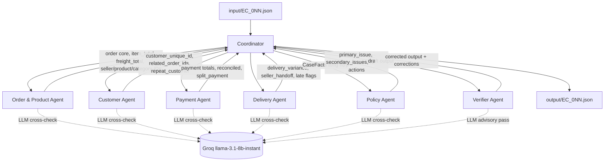

# Architecture — Multi-Agent E-commerce Dispute Resolution (EC_POLICY_V2)

## 1. Tổng quan

Hệ thống gồm 7 agent Python, mỗi agent sở hữu một domain dữ liệu riêng (đọc trực tiếp từ `data/*.csv` qua một `DataStore` được nạp một lần), handoff kết quả có cấu trúc (pydantic) cho nhau, và một Verifier kiểm chứng trước khi ghi `output/EC_0NN.json`. Sáu trong bảy agent có gọi LLM thật (Groq, `llama-3.1-8b-instant`, 8B tham số — thoả `<=10B` theo README §9); Coordinator không gọi LLM, chỉ điều phối.

**Nguyên tắc thiết kế cốt lõi (giải quyết mâu thuẫn giữa "chấm điểm exact-match" và "phải có LLM reasoning thật"):**

> Không có trường ID, số tiền, giờ chênh lệch hay ngày tháng nào trong `output/EC_0NN.json` do LLM tự viết ra. Mọi giá trị như vậy đến từ một hàm Python tất định (`src/tools/*.py`) đọc trực tiếp từ CSV. LLM chỉ được trả lời bằng boolean/enum đóng (vd. `multi_seller_order: bool`, `classification: "on_time"|"late_seller"|...`), dùng để **cross-check** lại giá trị tất định — không dùng để ghi ra output.

Mỗi agent có LLM đều tính sẵn "đáp án đúng" bằng code tất định, gọi LLM hỏi lại đúng câu hỏi đó, rồi so sánh:
- **Đồng ý** → ghi nhận corroboration vào `trace.jsonl`, không phạt điểm.
- **Bất đồng** → **giá trị tất định luôn là giá trị được ghi ra output**; sự bất đồng được log nguyên văn (prompt/response excerpt) vào `trace.jsonl` và trừ điểm `confidence`.
- **Groq lỗi/timeout sau retry** → agent dùng giá trị tất định, phạt nhẹ `confidence`, **không chặn case khác** (mỗi case chạy trong try/except riêng ở `src/runner.py`).

Kết quả thực nghiệm trên 50 case thật (xem `logging/trace.jsonl`, `logging/metadata.json`): 300/300 lệnh gọi Groq thành công, 0 lần Verifier phải sửa dữ liệu (evidence luôn hợp lệ, mảng luôn đúng giới hạn ngay từ đầu), nhưng **có bất đồng thật** giữa LLM và deterministic engine ở một số case (vd. `EC_022`: LLM đề xuất sai `primary_issue` do model 8B bỏ qua thứ tự ưu tiên của bảng chính sách — bị engine tất định ghi đè đúng, bất đồng được log và `confidence` giảm còn 0.3). Đây là bằng chứng cụ thể cho thấy LLM tham gia thật vào pipeline, chứ không phải "một prompt lớn gắn tên nhiều agent".

## 2. Sơ đồ luồng agent



Thứ tự thực thi thật trong `Coordinator.run_case` (`src/agents/coordinator.py`): **Order & Product → Customer → Payment → Delivery → Policy → Verifier**. Payment Agent phụ thuộc `item_total_brl`/`freight_total_brl` do Order & Product Agent tính; Policy Agent phụ thuộc kết quả của cả 4 agent domain trước đó (qua `CaseFacts`); Verifier chạy cuối cùng trên bản nháp output đã lắp ráp đầy đủ.

## 3. Ma trận vai trò & quyền truy cập dữ liệu

| Agent | File CSV được đọc | Import tool module | Có gọi LLM? | Việc LLM được quyết định |
|---|---|---|---|---|
| **Order & Product** | `orders`, `order_items`, `products`, `sellers`, `product_category_name_translation` (đúng order đang xét) | `src.tools.order_tools` | Có | Xác nhận 3 boolean: `multi_item_order`, `multi_seller_order`, `multiple_categories` |
| **Customer** | `customers`, index `orders_by_unique_id` | `src.tools.customer_tools` | Có | Xác nhận `repeat_customer` |
| **Payment** | `order_payments` (đúng order) + tổng item/freight nhận từ Coordinator | `src.tools.payment_tools` | Có | Xác nhận `split_payment`, `valid_split_payment_candidate` |
| **Delivery** | 5 field ngày của `orders` + `seller_id`/`shipping_limit_date` của `order_items` | `src.tools.delivery_tools` | Có | Phân loại `on_time`/`late_seller`/`late_logistics`/`not_applicable` |
| **Policy** | Không đụng CSV — chỉ nhận `CaseFacts` tổng hợp từ Coordinator | `src.tools.policy_tools` | Có | Đề xuất `primary_issue` + `secondary_issues` song song để cross-check |
| **Verifier** | Toàn bộ `DataStore` (chỉ để kiểm tra evidence tồn tại thật) | `src.tools.evidence` | Có (1 pass advisory) | Chỉ được nêu flag bất thường vào trace — **không được sửa giá trị** |
| **Coordinator** | Giữ tham chiếu `DataStore`, điều phối | — | Không | — |

Việc "chỉ import tool module thuộc domain mình" là cơ chế enforce phạm vi truy cập có thể kiểm chứng bằng cách đọc import ở đầu mỗi file agent (`src/agents/*.py`), không phải quy ước mềm. `olist_order_reviews_dataset.csv` và `olist_geolocation_dataset.csv` **không được nạp** — không công thức nào trong README §4/§6 dùng tới, và geolocation là file 1 triệu dòng sẽ tốn thời gian tải vô ích.

## 4. Data layer

`src/data/loader.py::load_data_store()` đọc 7/9 CSV **một lần duy nhất** khi process khởi động (không đọc lại theo từng case), dùng `dtype=str, keep_default_na=False` để giữ số 0 đầu (zip code) và tránh NaN ngầm, convert cột tiền/số sang `float`/`int` ngay sau đọc, giữ nguyên timestamp dạng string gốc từ CSV để xuất lại y hệt định dạng `YYYY-MM-DD HH:MM:SS`. Index dựng sẵn: `orders` theo `order_id`, `items_by_order`/`payments_by_order` (list theo order, đã sort theo `order_item_id`/`payment_sequential`), `orders_by_unique_id` (dựng qua merge `orders` + `customers` một lần, dùng cho customer history), `products_by_id`, `sellers_by_id`, `category_translation` (đọc `utf-8-sig` vì file này có BOM). Toàn bộ 99,441 order được nạp và index trong ~3.3 giây, đủ nhanh để 50 case chạy tuần tự không cần tối ưu thêm.

## 5. Chi tiết logic từng agent

### 5.1 Order & Product Agent (`src/agents/order_product_agent.py`)
Tính `item_ids`/`seller_ids`/`product_ids`/`category_names` (dedupe, cap đúng giới hạn schema), `item_total_brl`/`freight_total_brl` bằng **số nguyên cent** (`src/tools/money.py`) để tránh sai số float (vd. `18.269999999999996`). Category được dịch sang tiếng Anh qua `product_category_name_translation.csv`, bỏ qua category rỗng.

### 5.2 Customer Agent (`src/agents/customer_agent.py`)
Resolve `customer_unique_id` từ `customer_id` của order. `related_order_ids` lấy các order khác của cùng `customer_unique_id`, loại trừ order đang xét, **sắp theo `order_purchase_timestamp` tăng dần** — đây là một giả định tường minh vì README không quy định thứ tự (README chỉ nói "giữ thứ tự ổn định theo dữ liệu nguồn"). Nếu `investigation_scope.include_customer_history=false`, bỏ qua tra cứu lịch sử nhưng vẫn resolve `customer_unique_id` (trường bắt buộc trong schema).

### 5.3 Payment Agent (`src/agents/payment_agent.py`)
Không tự tính lại item/freight — nhận thẳng từ Coordinator (đến từ Order & Product Agent). Reconciliation tính bằng cent, dung sai 0.10 BRL. Khi order không có item (`has_items=False`): `expected_total_brl`, `difference_brl`, `reconciled` = `null`, nhưng `item_total_brl`/`freight_total_brl` **vẫn là `0.0`** (không null) — đúng theo cách đọc chữ nghĩa của README §4 (chỉ liệt kê 3 trường phải null). Đã xác nhận qua case thật `EC_012` (unavailable, 0 item, `payment_total_brl=226.23`).

### 5.4 Delivery Agent (`src/agents/delivery_agent.py`)
`delivery_variance_hours = delivered_at - estimated_at` (giờ, làm tròn 2 chữ số; `null` nếu chưa delivered). Seller handoff: group item theo `seller_id`, lấy **shipping_limit_date sớm nhất** mỗi seller (một seller có nhiều item chỉ cần bàn giao đúng hạn item sớm nhất), `handoff_variance_hours = carrier_handoff_at - shipping_limit_at`.

### 5.5 Policy Agent (`src/agents/policy_agent.py` + `src/tools/policy_tools.py`)
`classify_primary_issue()` là **if/elif tuần tự đúng thứ tự 6 dòng của README §4**, không bao giờ đảo thứ tự hay chọn "best fit" — dòng đầu tiên khớp sẽ thắng. Đây là module quan trọng nhất cho độ chính xác điểm số. Root-cause code map 1:1 cố định (`PRIMARY_ISSUE_ROOT_CAUSE`), nên `ranked_causes` luôn có đúng 1 phần tử — README không định nghĩa root cause phụ nên đây là đơn giản hoá có chủ đích, không phải thiếu sót. `resolution_actions` được suy ra theo điều kiện trigger cụ thể (xem `compute_resolution_actions`): action chính + `review_seller_handoff`/`review_carrier_delay` (nếu late_delivery_seller/logistics) + `verify_refund_completion` (nếu refund > 0) + `coordinate_multi_seller_case` (nếu multi-seller) + `verify_payment_allocation` (nếu split_payment và primary ≠ valid_split_payment) — tối đa đúng 5, khớp giới hạn schema, là tín hiệu mạnh cho thấy cách đọc này đúng.

### 5.6 Verifier Agent (`src/agents/verifier_agent.py`)
Chạy các bước tất định theo thứ tự: cap mảng theo đúng giới hạn (§6 README), re-assert null-handling cho order 0-item (double-check độc lập, không tin tưởng mù quáng upstream dù về logic đã đúng), lọc `evidence_ids` qua `DataStore` thật (`order_exists`/`item_exists`/`payment_exists`/`seller_exists`/mã root-cause hợp lệ) — evidence không tồn tại bị **drop** (không "sửa" thành ID khác chưa kiểm chứng), sắp lại `secondary_issues`/`resolution_actions` theo thứ tự nghiệp vụ chuẩn, ép `case_status` nhất quán với `primary_issue`, làm tròn mọi float 2 chữ số. Sau cùng mới gọi 1 lượt LLM advisory — chỉ để nêu flag, **không có quyền sửa giá trị**. Mỗi correction được ghi vào `trace.jsonl` với field/before/after/reason.

### 5.7 Coordinator (`src/agents/coordinator.py`)
Không gọi LLM. Lắp ráp `CaseFacts` cho Policy Agent, build `evidence_ids` (`src/tools/evidence.py` — ghép từ chính các ID đã cap sẵn ở affected_entities/payment_ids, **không bao giờ do LLM sinh** nên fabricated evidence không thể xảy ra về mặt cấu trúc), tính `confidence` (mục 6), lắp draft output, gọi Verifier, tính lại `confidence` cuối cùng sau khi biết số correction, rồi validate bằng `CaseOutput.model_validate()` trước khi ghi file. Nếu order không tồn tại trong CSV hoặc case raise exception không bắt được, `build_minimal_fallback_output()` đảm bảo luôn ghi đủ 50 file output (không case nào làm sập cả batch).

## 6. Công thức Confidence (`src/tools/confidence.py`)

Tất định 100%, không phải số do LLM tự nghĩ ra — mọi input đều là fact đo được hoặc boolean đồng ý/không đồng ý đã ghi vào `trace.jsonl`:

```
confidence = 1.0
  - min(0.40, 0.15 × số lần LLM bất đồng thật với deterministic)
  - 0.30 nếu Policy Agent LLM bất đồng về primary_issue
  - 0.10 nếu payment không reconciled
  - min(0.20, 0.05 × số lần Verifier phải sửa)
  - 0.05 × số lần LLM lỗi/không khả dụng
clamp về [0.05, 1.0], làm tròn 2 chữ số
```

Kết quả thật trên 50 case: mean 0.777, min 0.3 (case có nhiều bất đồng LLM thật, vd. `EC_022`), max 1.0 (LLM đồng ý toàn bộ).

## 7. Evidence construction (`src/tools/evidence.py`)

```
evidence_ids =
    [f"order:{order_id}"]
  + [f"item:{item_id}"    for item_id    in affected_entities.item_ids]     # đã có dạng "<order_id>:<n>"
  + [f"payment:{payment_id}" for payment_id in affected_entities.payment_ids]
  + [f"seller:{sid}" for sid in responsible_seller_ids]   # chỉ seller CHỊU TRÁCH NHIỆM, không phải mọi seller của order
  + [f"policy:{code}" for code in root_cause_codes]
```
Giới hạn lý thuyết 1+5+5+3+3=17 ≤ 20 nên không cần logic cắt riêng. Vì mọi ID ở đây đều được lấy lại từ chính các list đã build từ `DataStore` (không phải do LLM gõ ra), evidence giả không thể lọt vào output; Verifier vẫn kiểm tra lại độc lập làm lưới an toàn thứ hai.

## 8. Giả định/quyết định quan trọng cần lưu ý khi chấm

1. `affected_entities.seller_ids` = **tất cả** seller có item trong order (từ Order & Product Agent), khác với evidence `seller:` chỉ gồm seller **chịu trách nhiệm** — hai khái niệm khác nhau, cả hai đều bám sát chữ nghĩa README §5/§6.
2. `related_order_ids` sắp theo `order_purchase_timestamp` tăng dần (giả định, README không nói rõ).
3. Category dùng bản dịch tiếng Anh (`product_category_name_translation.csv`), fallback về tên tiếng Bồ nếu không có bản dịch.
4. `item_total_brl`/`freight_total_brl` = `0.0` (không null) khi order không có item; chỉ `expected_total_brl`/`difference_brl`/`reconciled` mới null.
5. Đã xác nhận thực nghiệm: cả 50 case thật đều khớp đúng 1 trong 6 dòng chính sách (0 `policy_edge_case`) — nhánh fallback cho trường hợp không khớp dòng nào (không delivered, không canceled, không unavailable) tồn tại trong code (`policy_tools.classify_primary_issue`) nhưng chưa từng được kích hoạt bởi dữ liệu thật.

## 9. Công nghệ sử dụng

Python 3.11, `pandas` (data layer), `pydantic v2` (validate handoff + output schema, `extra="forbid"`), `openai` SDK trỏ `base_url` sang Groq (JSON mode, retry/backoff thủ công trong `src/llm/groq_client.py`), không dùng LangGraph/CrewAI — orchestrator tự viết để kiểm soát toàn bộ trace logging và phạm vi truy cập dữ liệu từng agent. Model: `llama-3.1-8b-instant` (Groq, 8B tham số, thoả `<=10B`/agent theo README §9.1), khai báo tại `src/config.py` và lặp lại tại `logging/metadata.json`.

## 10. Cấu trúc thư mục

```
src/
├── config.py                # model name, tolerance, array limits
├── schemas/                 # input_models, records, handoff_models, output_models (pydantic)
├── data/loader.py           # DataStore — nạp + index CSV 1 lần
├── tools/                   # order/customer/payment/delivery/policy_tools, evidence, confidence, money, time_utils
├── llm/                     # groq_client.py, prompts.py
├── agents/                  # customer/order_product/payment/delivery/policy/verifier_agent, coordinator, common.py
├── tracing/trace_logger.py  # JSONL writer, ghi đè mỗi lần chạy
└── runner.py                # vòng lặp 50 case, cô lập lỗi từng case
main.py                      # CLI: --dry-run, --case-ids
```
